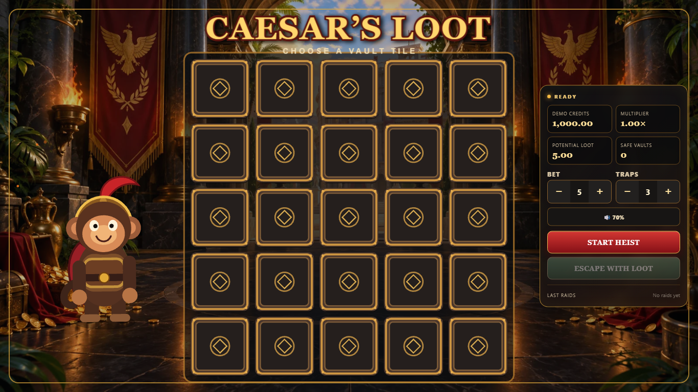

# Caesar’s Loot

An original instant-game prototype built with React, TypeScript, PixiJS, NestJS and WebSockets.

[Source](https://github.com/marcossroma/caesars-loot) ·
[Technical summary](docs/application/technical-summary.md) ·
[Gameplay recording plan](docs/portfolio/gameplay-video.md)

> Published portfolio prototype. Fictional demo credits only — no real money.
> Automated deployment smoke and isolated PostgreSQL tests pass. Formal release checks are tracked separately.

## Live Demo

[Frontend on Vercel](https://caesars-loot-server.vercel.app/).
Playable demo backed by Railway and dedicated Supabase PostgreSQL.
[Backend health](https://caesars-lootserver-production.up.railway.app/health).



Gameplay video is not published yet: [recording checklist](docs/portfolio/gameplay-video.md).

## Gameplay

Choose a trap count and fictional-credit bet, start the heist, reveal treasure tiles and
escape before finding a trap. No deposits, withdrawals or real-money features.

## Highlights

- One persistent responsive PixiJS renderer, reusable tiles and a bounded effects pool.
- Event-driven character reactions and gesture-unlocked procedural audio.
- Server-authoritative REST commands, realtime events and reconnect/resynchronization.
- PostgreSQL transactions and concurrency protections for anonymous demo rounds.
- Unit, integration and touch/recovery browser tests with measured performance evidence.

## Production Architecture

Vercel (React/PixiJS) → HTTPS REST + WSS (Railway NestJS) → Supabase PostgreSQL.
Fictional demo credits only; no real money or login requirement.

## Deployment

See [deployment](docs/deployment.md), [environments](docs/environments.md),
[rollback](docs/rollback.md) and [release checklist](docs/release-checklist.md).

Caesar’s Loot is an original instant-game prototype created to explore interactive frontend game
development using React, TypeScript and PixiJS.

The project focuses on realtime rendering, animation, responsive interaction, client-server state
synchronization and frontend performance. It is a technical portfolio project and uses fictional
demo credits only—there are no deposits, withdrawals, payments, KYC or real-money features.

## Visual direction

Premium cartoon Roman adventure: dark marble, imperial red, bronze, firelight and gold, led by an
expressive monkey gladiator raiding Caesar’s treasury. The supplied reference boards guide the
identity without reproducing an existing game or layout.

## Tech stack

- React, TypeScript and Vite for the application shell and HUD
- PixiJS v8 for the persistent responsive Canvas/WebGL gameplay scene
- NestJS REST API plus Socket.IO Gateway for authoritative commands, events and resynchronization
- Supabase managed PostgreSQL through Drizzle ORM and versioned migrations
- Vitest, Playwright and NestJS Testing for critical-path coverage

## Architecture

```text
apps/web       React shell and persistent responsive PixiJS scene
apps/server    Authoritative NestJS REST API, Socket.IO and PostgreSQL persistence
packages/shared     Shared contracts and game-state types
packages/game-math  Framework-independent demonstrative game math
packages/config     Shared design tokens and future tooling presets
assets              Versioned game asset categories
docs                Architecture and interview documentation
```

```text
React HUD + PixiJS → GameController → REST commands → NestJS GameEngine
                              ↑                              │
                              └── Socket.IO events ← GameEventPublisher
```

React owns the HUD, PixiJS owns rendering, and `GameController` coordinates network and animation
state. The NestJS game engine is authoritative for trap positions, reveal outcomes, demo credits,
multipliers and payouts. Public DTOs never expose traps while a round is active.

## Persistence

NestJS uses repository interfaces backed by Drizzle/PostgreSQL when `DATABASE_URL` is configured.
Sessions, rounds, revealed state, private traps and critical events survive process restarts. Start,
reveal and cashout run in transactions; row locks plus a partial unique index prevent double
settlement and multiple active rounds. In-memory repositories remain for isolated tests and local
development without a database. See [database documentation](./docs/database.md).

## Realtime architecture

Player intent (`start`, `reveal`, `cashout`) remains on REST. After each authoritative transition,
the backend publishes versioned Socket.IO events to the validated `session:{sessionId}` room. The
client keeps one socket per tab, replaces server values instead of incrementing them, rejects
duplicate or out-of-order envelopes, and fetches `GET /api/session/:sessionId/state` after rejoining.
The session ID is scoped to `sessionStorage`, so refresh can restore the demo session without
persisting it indefinitely.

## Character Animation

The gladiator monkey is a persistent PixiJS entity, separate from React and networking. A
`GameFeelDirector` listens to the internal game event bus and coordinates the character's
cancellable, priority-driven reactions with particles and camera feedback.

The current original fallback is drawn once from reusable PixiJS graphics because isolated
production sprites are not yet available. Animation uses absolute position, scale and rotation
poses from a stored baseline, so repeated rounds cannot accumulate transform drift. A fixed pool
provides small gold, coin and dust accents without allocating objects per frame. The same single
scene ticker advances the character and is removed with every event listener on disposal.

Responsive layout keeps the character beside the board on desktop and reduces it to a compact
companion above the play area on portrait mobile. `prefers-reduced-motion` lowers movement amplitude
and effect density while preserving readable state feedback. See
[`docs/character-system.md`](./docs/character-system.md) for the full event and lifecycle model.

## Particles and camera effects

The PixiJS scene now owns a fixed 250-object particle pool with gold, coin, gem, smoke, dust and
ambient ember presets. A single camera container moves the board, character and foreground effects,
while the background, Pixi overlay and React HUD stay stable. Low/medium/high quality selection,
adaptive FPS fallback, reduced-motion behavior, live diagnostics and 100/250/500 stress controls
are available in development. See [`docs/game-feel.md`](./docs/game-feel.md).

## Mobile-first Design

The game uses one full-viewport PixiJS canvas and a compact React HUD, with the board receiving the
largest viable area before character or decorative elements. A central responsive layout config
defines mobile, tablet, desktop, wide and compact-landscape behavior; the board is sized from the
usable width, height and reserved HUD space without rebuilding its 25 tiles.

Touch interaction uses one primary Pointer Events sequence per tile, immediate press feedback and
controller-level input locking. Primary actions and steppers provide 44 px targets, support safe-area
insets and remain in the lower thumb zone on portrait phones. `100dvh` handles mobile browser chrome,
while a requestAnimationFrame-throttled observer handles resize and orientation without recreating
the PixiJS application.

Rendering uses PixiJS `autoDensity` and caps device pixel ratio at 2×. Phone and compact-landscape
layouts automatically select low effect density; the manual Reduced Effects preference is persisted
alongside the system motion preference. See [`docs/mobile-testing.md`](./docs/mobile-testing.md).

## Sound and settings

A decoupled `SoundManager` owns one gesture-unlocked Web Audio context, semantic procedural cues,
priority interruption, rate limiting and lifecycle cleanup. Gameplay audio is routed through
`GameEventBus` and `GameFeelDirector`; it is not coupled to REST, React rendering or Pixi entities.
Mute, volume and Reduced Effects are stored as one validated settings object and survive reload and
recovery. See [`docs/audio-system.md`](./docs/audio-system.md).

## Error recovery

Network, session, round, validation, socket, asset and unexpected failures share one typed error
model with themed production-safe messages. GETs have one bounded retry, mutations are never
replayed automatically, and uncertain round outcomes are resolved by authoritative resync. Pending
requests are abortable and epoch-guarded against stale responses. See
[`docs/error-recovery.md`](./docs/error-recovery.md).

## Running locally

Requirements: Node.js 22.22.3+ (see `.nvmrc`) and npm 11.

```bash
npm ci
npm run build --workspace=@caesars-loot/shared
npm run build --workspace=@caesars-loot/game-math
npm run build --workspace=@caesars-loot/config
npm run dev:web
npm run dev:server
```

For persistence, configure `DATABASE_URL`/`DIRECT_URL` from `.env.example` and run
`npm run db:migrate` before starting NestJS. Production requires `DATABASE_URL`.

Web: `http://localhost:5173`  
API: `http://localhost:3000`
Swagger: `http://localhost:3000/api/docs`

## Quality checks

```bash
npm run lint
npm run typecheck
npm test
npm run build
```

## Testing & QA

The layered suite uses Vitest for game math, state/controller behavior, API clients, backend HTTP and
Gateway integration, React components, PixiJS resources and deterministic soak cases. Playwright
tests responsive/touch critical paths, reconnect/recovery and lifecycle behavior in a real browser.

```bash
npm run test:coverage
npm run test:e2e:mobile
```

GitHub Actions runs the deterministic quality gate and browser E2E as separate jobs. Browser failure
traces/screenshots are retained as artifacts. See [QA matrix](./docs/qa-matrix.md),
[edge cases](./docs/edge-cases.md) and [regression checklist](./docs/regression-checklist.md).

[CI run 35156783870](https://github.com/marcossroma/caesars-loot/actions/runs/35156783870)
passed lint, typecheck, formatting, build and 162 tests: 47 backend, 89 frontend and 26 game-math.
The backend count includes five integration tests against disposable PostgreSQL, not the live
Supabase database. Local runs without `TEST_DATABASE_URL` intentionally skip those five tests.
[Quality CI](https://github.com/marcossroma/caesars-loot/actions/runs/35240736062) and
[complete browser CI](https://github.com/marcossroma/caesars-loot/actions/runs/35240736079)
passed on commit `35c3258`. The settings failure trace showed correct persisted values but an
exhausted total test deadline; redundant initialization was removed and CI budgets adjusted.
Rendering and recovery run in separate processes, with every assertion retained.

## Performance

Milestone 12 profiles the production preview rather than assuming where the game is slow. The
critical background was reduced from 2,469,435 to 240,998 bytes (−90.24%), the artificial 900 ms
loading floor was removed, and focused controller selectors reduced a six-second idle sample from
80 to 7 HUD commits and from 69 to 1 result-overlay commit. Pixi remains one application with five
central main-scene ticker callbacks, a fixed 250-object particle pool, capped 2× DPR and complete
teardown ownership.

Reproducible asset, bundle, loading, REST and forced-GC tools live under `scripts/`. Hardware Chrome
FPS/DevTools results are deliberately marked manual where headless software WebGL is not credible.
See the [performance baseline](./docs/performance-baseline.md),
[optimization log](./docs/performance-optimizations.md),
[test procedure](./docs/performance-testing.md) and
[technical case study](./docs/performance-case-study.md).

## Demo math

`packages/game-math` contains intentionally demonstrative calculations for a portfolio prototype.
They do not model or certify real-money gaming behavior.

## Roadmap

See [PROJECT_STATUS.md](./PROJECT_STATUS.md). Public HTTPS/WSS, touch/reload, private traps,
concurrent settlement and active-round persistence across a Railway redeploy are verified.
Physical-device/browser review, branch protection and recorded video remain manual; no v1.0.0
release or submitted application is claimed.

## Deployment plan

- Frontend: Vercel
- Backend: Railway
- Database: Supabase PostgreSQL
- Source: GitHub

Secrets are supplied through private backend environment variables and must never be committed.

## What I Learned

- Persist rendering resources independently of React snapshots.
- Separate authoritative transitions from cancellable visual feedback.
- Resynchronize uncertain commands without replaying mutations.
- Reset event sequence epochs correctly after a server restart.
- Test race conditions against isolated PostgreSQL, never production.
- Optimize measured blocking assets and subscriptions before rewriting rendering loops.

## Portfolio and Interview

See the [project package](docs/application/project-summary.md),
[code tour](docs/interview/code-tour.md), [two-/five-minute demo scripts](docs/interview/demo-scripts.md)
and [curriculum/LinkedIn drafts](docs/application/career-drafts.md).
Video publication, profile updates and job applications remain manual actions.

## Future Improvements

Production character sprite art, keyboard canvas navigation, localization and stronger
observability. Distributed scaling requires shared Socket.IO and rate-limit adapters.
No login, payments or real-money system is implied by this prototype.
