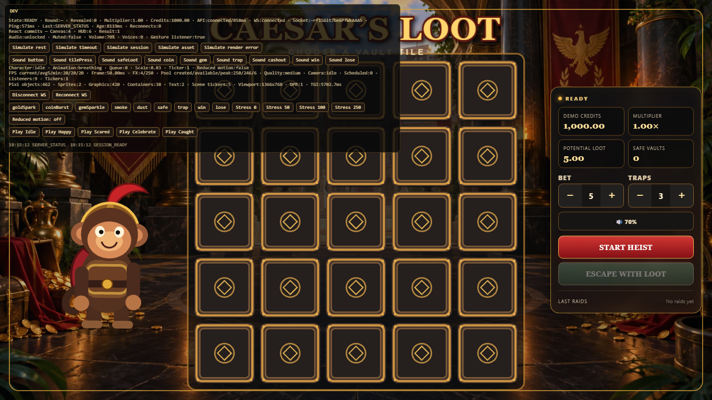

# Caesar’s Loot Performance Case Study

## Milestone 14 hosted baseline

Measured 2026-09-17 at 14:59 UTC using the public Vercel frontend and public Railway API.
One headless Chromium/software-WebGL sample per viewport, DPR 1, during deployment validation:

| Viewport  | Navigation | Start enabled | Asset load measure |
| --------- | ---------: | ------------: | -----------------: |
| 1366×768  |     430 ms |     11,670 ms |             821 ms |
| 1920×1080 |     297 ms |     10,137 ms |           1,417 ms |
| 390×844   |     422 ms |      6,396 ms |             468 ms |
| 844×390   |     317 ms |      6,008 ms |             454 ms |

Public API single-request samples: config 500 ms, session 465 ms, history 619 ms, resync
807 ms, start 1,653 ms, reveal 1,396 ms and cashout 1,793 ms. These are observations, not
percentiles or hardware-user guarantees. The backend is in US West; Supabase is in São Paulo,
so cross-region transactional round trips remain a known latency tradeoff. The first mixed
benchmark used a local API and is deliberately excluded from these public API measurements.

Software-WebGL reported GPU readback stalls and distorted frame cadence; no hardware FPS
claim is made. Physical mobile/thermal and hardware Chrome profiling remain manual. The
treasury WebP is still 240,998 bytes at 1600×900; the entry stays below its 600,000-byte budget.
Reproduce with CAESARS_LOOT_PERF_URL and CAESARS_LOOT_API_URL both set to public HTTPS URLs.

## Context

Caesar’s Loot is a mobile-first portfolio instant game. React owns the HUD and recovery UI, one persistent PixiJS application owns gameplay rendering, NestJS owns authoritative REST commands, and Socket.IO distributes committed state. The goal was stable, attractive interaction—not maximum visual density.

## Initial Architecture

The game already had a strong lifecycle boundary: React state changes did not rebuild Pixi, all animation used one application ticker, resize mutated the existing scene, and particles came from a fixed 250-object pool. That meant profiling could focus on loading, subscriptions, resource weight and lifecycle stability instead of rewriting the renderer.

## What I Measured

I created a production-preview benchmark for 1366 × 768, 1920 × 1080, 390 × 844 and 844 × 390. It captures Time to Game Interactive, navigation/resource timing, five seconds of RAF cadence, precise heap signals and console warnings. Separate tools audit asset dimensions/bytes, enforce bundle/asset budgets, exercise 50 rounds with forced GC, and time REST endpoints/payload sizes.

For Pixi I counted display-object categories, ticker ownership, particles created/active/available/peak and cleanup. For React I used development `Profiler` commit counters over an identical six-second idle flow. Hardware Chrome Performance/Memory and React DevTools steps are documented separately where automation cannot produce trustworthy GPU results.

## Bottlenecks Found

1. A 2,469,435-byte critical PNG blocked interactivity.
2. Loading enforced a minimum 900 ms pause after assets, even when ready.
3. The HUD and result overlay subscribed to the entire controller snapshot, so diagnostic updates caused 80 and 69 commits respectively in six idle seconds.

## Changes Made

- Converted the visually inspected background to a 240,998-byte 1,600 × 900 WebP and preserved the source PNG outside production output.
- Removed the artificial loading floor and added User Timing marks for Pixi init, assets, session and first interaction.
- Added shallow, cached controller selectors for HUD and Result while leaving the DEV overlay intentionally broad.
- Replaced recurring particle-pool filtering with acquire/release counters and expanded the existing overlay without another loop.
- Added asset/bundle budgets and reproducible performance scripts.

## Results

- Critical background: −2,228,437 bytes (−90.24%).
- React idle commits over six seconds: HUD 80 → 7 (−91.25%); Result 69 → 1 (−98.55%); Canvas 4 → 4.
- Mobile production TGI in the same automated environment: 3,205 → 2,798 ms portrait and 2,764 → 2,426 ms landscape. Desktop was noisier/slower under software WebGL, so I did not claim a desktop win.
- Entry JavaScript moved from 563,439 to 566,881 bytes (+3,442) for diagnostics/selectors and remains below the measured 600,000-byte budget.
- READY scene census: 462 objects with a fixed 250-object particle pool and five main-scene ticker callbacks.
- Forced-GC used heap was 9.57 MB at READY, 11.48 MB after 10 rounds, 11.80 MB after 25 and 11.74 MB after 50; one canvas remained and the 25→50 sample plateaued.

## Mobile Considerations

Phone and short-landscape layouts already choose LOW effect quality and cap renderer DPR at 2. The visual asset was reduced without removing Roman atmosphere. The standard test matrix includes both 390 × 844 and 844 × 390. Hardware DPR 2/3, 4× CPU and thermal tests remain explicitly manual rather than presenting headless software-WebGL FPS as device performance.

## Tradeoffs

WebP is lossy, selector field lists require maintenance, and useful diagnostics added 3.4 kB raw to the entry. I kept the 250-particle pool and procedural graphics because frame profiling did not justify reducing the game's personality or introducing an atlas pipeline. Stable gameplay remains more important than maximum effects.

## What I Learned

The largest gains were outside the Pixi render loop. A strong ownership model made ticker and memory behavior predictable, while an oversized blocking asset and broad React subscriptions were measurable, low-risk targets. The most important reporting decision was also restraint: headless WebGL FPS was visibly distorted, so it is retained as a regression diagnostic and not marketed as real-device performance.
